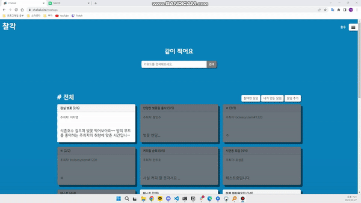
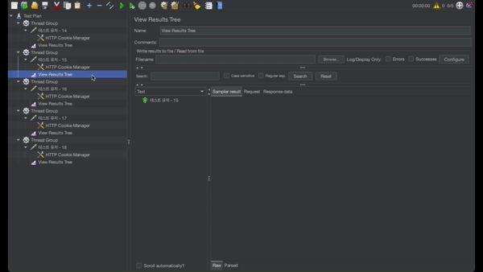

 

## 📸 사진 공유 플랫폼, 찰칵!

여기저기 흩어져 있는 출사 관련 정보 및 커뮤니티를 한 곳에서!   
`찰칵(Chalkak)`은 출사 관련 정보를 공유하는 플랫폼이자 커뮤니티 입니다.   
<!-- [여기](https://www.chalkak.site/)를 클릭해 사이트를 확인하세요 🙂 -->

[📷 찰칵 사이트로 이동하기](https://www.chalkak.site)   
[ Back-End 깃허브로 이동하기](https://github.com/chalkak2023/Chalkak-Backend)   
[ Front-End 깃허브로 이동하기](https://github.com/chalkak2023/Chalkak-frontend)

 

### 🤔 개발 동기

> 나만이 알고 있는 매력적인 포토스팟을 테마별 콜렉션으로 공유하여 누구나 쉽게 사진 명소를 찾을 수 있도록 돕습니다.   
>    
> 찍고, 찍어주고, 대화하고, 함께해요. 출사 모임을 직접 만들거나 참여하여 우리의 사진과 삶을 함께 나눕니다.

 
 

## 📌 목차 

- [서비스 아키텍처](#%EF%B8%8F-서비스-아키텍처)
- [설계](#-설계)
- [주요 기능](#-주요-기능)
- [기술적 의사결정](#%EF%B8%8F-기술적-의사결정)
- [트러블슈팅](#%EF%B8%8F%EF%B8%8F-트러블슈팅)
- [시연 영상](#-시연-영상)
- [지원하는 브라우저](#-지원하는-브라우저)
- [팀원 소개](#-팀원-소개)

 
 

## ⚙️ 서비스 아키텍처

  <!-- Nest.js -->
  
  <!-- Node.js -->
  
  <!-- TypeScript -->
  

  <!-- React -->
  
  <!-- Redux -->
  

  <!-- AWS -->
  
  
  
  <!-- Vercel -->
  
  <!-- GitHub Actions -->
  

  <!-- MySQL -->
  
  <!-- Redis -->
  
  <!-- Docker -->
  

 
 

## 🛠 설계

  
ERD

  

    <ul>
      

      <a href="https://google.com" target="_blank">ERD 보러가기</a>
    </ul>
  

  
API

  

    <ul>
      

      <a href="https://google.com" target="_blank">API 보러가기</a>
    </ul>
  

 
 

## 🚀 주요 기능

  
포토스팟 콜렉션

  

    <ul>
      
      <li>Kakao Map API를 이용해 원하는 좌표에 포토스팟 저장 기능</li>
      <li>포토스팟 저장 시 최대 5장의 사진 저장 기능</li>
      <li>좋아요 기능</li>
    </ul>
  

  
사진 모아보기

  

    <ul>
      
      <li>클릭한 사진과 비슷한 사진을 보여주는 추천 시스템</li>
      <li>추천 시스템을 위해 업로드 하는 사진에 대해 자동 라벨링 기능 구현</li>
      <li>Google Vision API 사용</li>
    </ul>
  

 

  
함께 찍어요 & 채팅

  

    <ul>
      
      <li>출사 모임 모집 기능</li>
      <li>주최자가 모집 마감 시 채팅으로 넘어가 참여자들 끼리 채팅 할 수 있는 기능 구현</li>
    </ul>
  

 
 

## 👨‍⚖️ 기술적 의사결정

  
Bull Queue

  

    <ul>
      <li>Kakao Map API를 이용해 원하는 좌표에 포토스팟 저장 기능</li>
      <li>포토스팟 저장 시 최대 5장의 사진 저장 기능</li>
    </ul>
  

  
AWS S3

  

    <ul>
      <li>Kakao Map API를 이용해 원하는 좌표에 포토스팟 저장 기능</li>
      <li>포토스팟 저장 시 최대 5장의 사진 저장 기능</li>
    </ul>
  

 

  
DB 모델링 STI

  

    <ul>
      <li>Kakao Map API를 이용해 원하는 좌표에 포토스팟 저장 기능</li>
      <li>포토스팟 저장 시 최대 5장의 사진 저장 기능</li>
    </ul>
  

  
CI/CD

  

    <ul>
      <li>Kakao Map API를 이용해 원하는 좌표에 포토스팟 저장 기능</li>
      <li>포토스팟 저장 시 최대 5장의 사진 저장 기능</li>
    </ul>
  

 
 

## 🕵️‍♂️ 트러블슈팅

  
유저 블락 전략

  

    <ul>
      <li>Kakao Map API를 이용해 원하는 좌표에 포토스팟 저장 기능</li>
      <li>포토스팟 저장 시 최대 5장의 사진 저장 기능</li>
    </ul>
  

  
이미지 리사이징

  

    <ul>
      <li>Kakao Map API를 이용해 원하는 좌표에 포토스팟 저장 기능</li>
      <li>포토스팟 저장 시 최대 5장의 사진 저장 기능</li>
    </ul>
  

 

  
즉각적인 Bull Queue의 작업 결과 응답

  

    <ul>
      <li>Kakao Map API를 이용해 원하는 좌표에 포토스팟 저장 기능</li>
      <li>포토스팟 저장 시 최대 5장의 사진 저장 기능</li>
      <li>해결 전</li>
      
      
      <li>해결 후</li>
      
      
    </ul>
  

 
 

## 🎥 시연 영상

 
 

## 🌏 지원하는 브라우저

|  |
| :-: |
|latest|

 
 

## 👨‍👨‍👧‍👦 팀원 소개

|  |  |  |  |
| :-: | :-: | :-: | :-: |
| 이보형 | 조성훈 | 박무현 | 박진 |
| 리더 | 부리더 | 팀원 | 팀원 |
| [깃허브](https://github.com/boleesystem), [블로그](https://boleesystem.tistory.com) | [깃허브](https://github.com/cchoseonghun), [블로그](https://4sii.tistory.com) | [깃허브](https://github.com/muja-code), [블로그](https://muja-coder.tistory.com) | [깃허브](https://github.com/tstunas), [블로그](https://velog.io/@tstunas3) |
| boleesystem@gmail.com | cchoseonghun@gmail.com | pla2697@gmail.com | zoc6521@naver.com |
