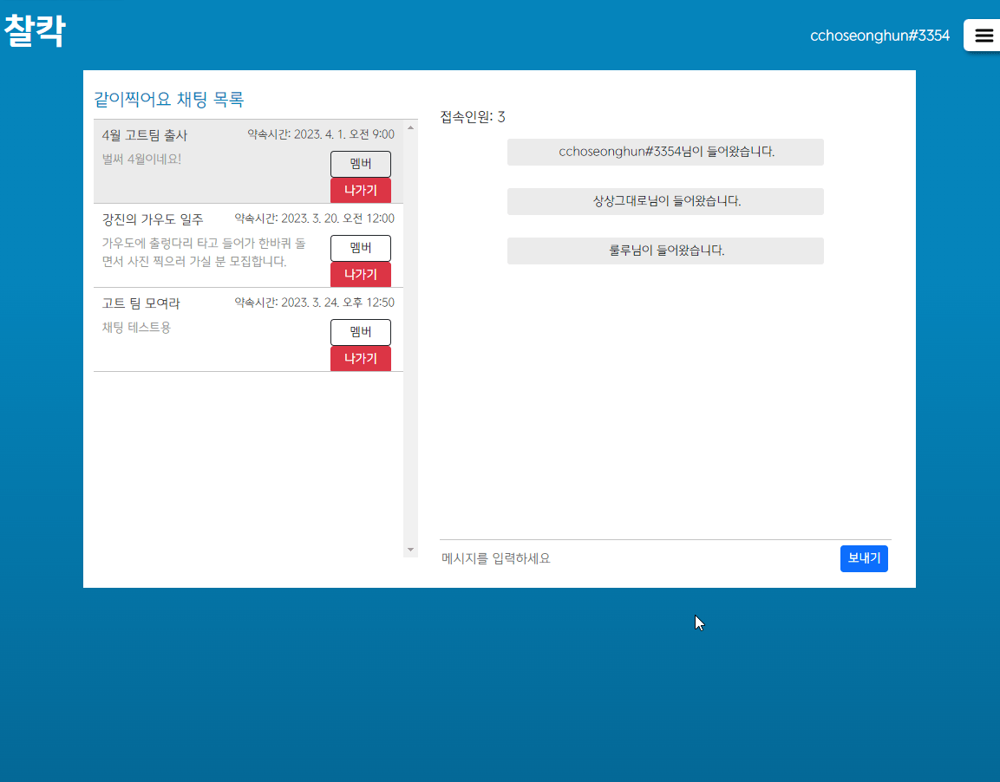
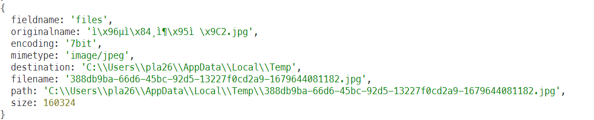

<br>
<br>

# 📸 사진촬영장소 공유 웹사이트, 찰칵!

[](https://www.chalkak.site)

<br>

여기저기 흩어져 있는 출사 관련 정보 및 커뮤니티를 한 곳에서!   
`찰칵(Chalkak)`은 출사 관련 정보를 공유하는 플랫폼이자 커뮤니티 입니다.   

나만이 알고 있는 매력적인 포토스팟을 테마별 콜렉션으로 공유하여   
누구나 쉽게 사진 명소를 찾을 수 있도록 돕습니다.   

찍고, 찍어주고, 대화하고, 함께해요!   
출사 모임을 직접 만들거나 참여하여 우리의 사진과 삶을 함께 나눕니다.

<br>
<br>

## 🌄 &nbsp;촬영장소와 사진을 공유할 수 있습니다!
<details>
  <summary>나만의 <code>콜렉션</code>을 만들어 <code>포토스팟</code>을 공유하세요.</summary>
  
</details>
<details>
  <summary>마음에 든 콜렉션에 하트를 눌러 <code>좋아요</code>를 표현하세요.</summary>
  
</details>

<br>

## 🏞 &nbsp;사진 추천 기능을 이용해보세요!
<details>
  <summary>사진 <code>라벨링</code> 기술을 통해 비슷한 사진을 추천해줍니다.</summary>
  
</details>

<br>

## 🌃 &nbsp;저랑 같이 사진 찍으러 갈래요?
<details>
  <summary><code>모임</code>을 만들어 같이 사진 찍으러 갈 동료를 구할 수 있습니다.</summary>
  
</details>
<details>
  <summary>주최자가 모집 마감 버튼을 누르면 <code>채팅</code> 메뉴에서 참여자들끼리 대화할 수 있습니다.</summary>
  
  
</details>

<br>
<br>

## 👀 &nbsp;자, 이제 준비 됐나요? `찰칵`을 직접 경험해보세요!

[📷 찰칵 사이트로 이동하기](https://www.chalkak.site)   

<br>
<br>

## 📌 목차 

- [시연 영상](#-시연-영상)
- [기술적 의사결정](#%EF%B8%8F-기술적-의사결정)
- [트러블슈팅](#%EF%B8%8F%EF%B8%8F-트러블슈팅)
- [서비스 아키텍처](#%EF%B8%8F-서비스-아키텍처)
- [프로젝트 구조](#-프로젝트-구조)
- [설계](#-설계)
- [지원하는 브라우저](#-지원하는-브라우저)
- [팀원 소개](#-팀원-소개)

<br>
<br>

## 🎥 시연 영상

> 아래 이미지를 클릭하면 시연 영상을 시청할 수 있습니다.

[](https://youtu.be/tZ_j9On3WuA)

<br>
<br>

## 👨‍⚖️ 기술적 의사결정

<details>
  <summary><b>[동시성 처리] Bull Queue</b></summary>
  <div markdown="1">
    </br>
    <ul>
      <li>도입배경</li>
        <ul>
          <li>모임 참여 기능에서 동시 요청으로 인해 정해진 신청 인원을 초과하는 상황을 고려하여 동시성 제어가 필요했다.</li>
        </ul>
      </br>
      <li>기술비교</li>
        <table width="70%">
          <thead>
            <tr>
              <th></th>
              <th>Bull Queue</th>
              <th>RabbitMQ</th>
              <th>Kafka</th>
            </tr>
          </thead>
          <tbody>
            <tr>
              <td>간단 설명</td>
              <td>Node.js 기반 메시지 큐</td>
              <td>AMQP 기반으로 하는 오픈 소스 메시지 브로커</td>
              <td>분산 스트리밍 플랫폼</td>
            </tr>
            <tr>
              <td>성능</td>
              <td>Redis 기반 높은 성능 / 순서가 엄격히 보장 X</td>
              <td>고성능</td>
              <td>높은 처리량 / 낮은 지연 시간</td>
            </tr>
            <tr>
              <td>사용성</td>
              <td>가볍고 편리</td>
              <td>많은 클라이언트 라이브러리</td>
              <td>초기 설정 및 복잡한 운영</td>
            </tr>
            <tr>
              <td>안정성</td>
              <td>안정성 이슈 (Redis 및 처리량 관련)</td>
              <td>안정적 (AMQP 사용)</td>
              <td>높은 안정성</td>
            </tr>
            <tr>
              <td>확장성</td>
              <td>높은 확장성, 분산 처리 지원</td>
              <td>높은 확장성, 분산 처리 지원</td>
              <td>높은 확장성, 분산 처리 지원</td>
            </tr>
            <tr>
              <td>보안성</td>
              <td>안전한 데이터 전송 및 저장</td>
              <td>안전한 데이터 전송 및 저장</td>
              <td>안전한 데이터 전송 및 저장</td>
            </tr>
            <tr>
              <td>사용 사례</td>
              <td>대규모 분산 시스템, 실시간 데이터 처리, 백그라운드 작업 처리</td>
              <td>대규모 분산 시스템, 메시지 큐, 이벤트 기반 애플리케이션</td>
              <td>대규모 분산 시스템, 이벤트 스트리밍 처리, 로그 수집 및 분석</td>
            </tr>
          </tbody>
        </table>
        </br>
        <ul>
          <li>Bull Queue</li>
            <ul>
              <li>장점</li>
                <ul>
                  <li>Node.js 환경에서 운영된다. Node.js 개발자들이 쉽게 사용 가능하며 높은 처리량과 낮은 지연 시간을 제공한다.</li>
                  <li>빠른 처리 속도와 높은 신뢰성을 가지고 있는 Redis 기반이다.</li>
                </ul>
              <li>단점</li>
                <ul>
                  <li>다른 메시지 큐와 비교했을 때 기능이 제한적이며, 대규모 분산 시스템에서 사용성이 제한적이다.</li>
                </ul>
            </ul>
          </br>
          <li>RabbitMQ</li>
            <ul>
              <li>장점</li>
                <ul>
                  <li>AMQP(Advanced Message Queuing Protocol)을 기반으로 하여 안정성이 보장되며 다양한 기능을 제공한다. 다양한 언어에 대해 지원하고, 대규모 분산 시스템에서도 안정적으로 동작한다.</li>
                </ul>
              <li>단점</li>
                <ul>
                  <li>브로커 자체의 성능이 중요한 경우에는 다른 시스템과 비교해 처리량이 낮을 수 있다.</li>
                </ul>
            </ul>
          </br>
          <li>Kafka</li>
            <ul>
              <li>장점</li>
                <ul>
                  <li>높은 처리량과 낮은 지연 시간을 제공하며 분산 스트리밍 처리에 적합하다. 그리고 데이터를 병렬로 처리하기 때문에 처리량이 높다.</li>
                </ul>
              <li>단점</li>
                <ul>
                  <li>주로 대용량 처리를 위해 사용한다. 상대적으로 복잡하고 운영 관리가 어려울 수 있다.</li>
                </ul>
            </ul>
        </ul>
      </br>
      <li>최종결정</li>
        <ul>
          <li>RabbitMQ는 프로토콜, 인증, 권한, 가상 호스트 등의 복잡한 설정이 필요하며, Kafka는 메시지의 연속성을 위해 디스크에 메시지를 저장해야 하기 때문에 별도의 디스크 및 로그 설정이 필요하다. 이러한 설정이 잘못되면 시스템 성능에 영향을 미치고 결함을 일으킬 수 있다. 이 문제를 해결하기 위해서는 별도의 학습 시간이 필요하다.</li>
          <li>찰칵은 단기간 프로젝트로 빠르게 적용할 수 있는 Node.js 기반의 메시지 큐이면서 빠른 처리 속도를 가진 Redis를 사용하여 데이터 처리를 하는 Bull Queue를 사용해 동시성 제어를 위한 작업 대기열 방식을 적용하기로 결정하였다.</li>
        </ul>
    </ul>
    </br>
  </div>
</details>

<details>
  <summary><b>[이미지 스토리지] AWS S3</b></summary>
  <div markdown="1">
    </br>
    <ul>
      <li>도입배경</li>
        <ul>
          <li>유저수, 서비스 사용량 증가 등에 따라 저장하는 사진 파일이 많아지면 스토리지 공간을 확장해야 한다. 그렇기 때문에 서비스의 확장성을 고려해 스토리지 공간이 필요한 만큼 동적으로 할당해 효율적으로 사진을 관리할 수 있는 클라우드 기반의 객체 스토리지 서비스가 필요하였다.</li>
        </ul>
      </br>
      <li>기술비교</li>
        <table width="70%">
          <thead>
            <tr>
              <th></th>
              <th>AWS S3</th>
              <th>Google Cloud Storage</th>
              <th>Microsoft Azure Blob Storage</th>
            </tr>
          </thead>
          <tbody>
            <tr>
              <td>비용</td>
              <td>저렴한 가격 대비 높은 성능</td>
              <td>저렴한 가격 대비 높은 성능</td>
              <td>비교적 높은 가격</td>
            </tr>
            <tr>
              <td>기능성</td>
              <td>높은 내구성 및 가용성</td>
              <td>고성능 및 확장성</td>
              <td>관리 작업 간소화 기능</td>
            </tr>
            <tr>
              <td>보안성</td>
              <td>액세스 제어, 객체 수준 암호화 및 다양한 암호화 방식 제공</td>
              <td>액세스 제어, 객체 수준 암호화 및 다양한 암호화 방식 제공</td>
              <td>액세스 제어, 객체 수준 암호화 및 다양한 암호화 방식 제공</td>
            </tr>
            <tr>
              <td>데이터 복제</td>
              <td>지리적으로 분산된 데이터 복제 가능</td>
              <td>지리적으로 분산된 데이터 복제 가능</td>
              <td>지리적으로 분산된 데이터 복제 가능</td>
            </tr>
            <tr>
              <td>사용 편의성</td>
              <td>AWS Management Console, CLI, SDK 등 다양한 도구를 사용한 구성 및 관리 가능</td>
              <td>RESTful API 및 CLI를 사용하여 쉽게 구성 및 관리 가능</td>
              <td>Azure Portal, PowerShell, CLI 등 다양한 도구를 사용하여 구성 및 관리 가능</td>
            </tr>
          </tbody>
        </table>
        </br>
        <ul>
          <li>AWS S3</li>
            <ul>
              <li>장점</li>
                <ul>
                  <li>저렴한 비용으로 매우 빠르고 안정적인 전송 속도와 데이터 신뢰성을 제공한다.</li>
                  <li>다양한 객체 타입을 지원하여 많은 종류의 데이터를 저장할 수 있다.</li>
                  <li>지리적으로 분산 된 데이터 복제 기능을 제공하여 데이터 손실을 방지한다.</li>
                  <li>AWS Management Console, CLI, SDK를 사용하여 구성 및 관리가 가능하다.</li>
                </ul>
              <li>단점</li>
                <ul>
                  <li>트래픽이 너무 많을 경우 비용이 높을 수 있다.</li>
                </ul>
            </ul>
          </br>
          <li>Google Cloud Storage</li>
            <ul>
              <li>장점</li>
                <ul>
                  <li>매우 빠르고 안정적인 전송 속도와 데이터 신뢰성을 제공한다.</li>
                  <li>저렴한 가격에 높은 성능을 제공한다.</li>
                  <li>지리적으로 분산 된 데이터 복제 기능을 제공하여 데이터 손실을 방지한다.</li>
                  <li>RESTful API와 CLI를 사용하여 쉽게 구성 및 관리할 수 있다.</li>
                </ul>
              <li>단점</li>
                <ul>
                  <li>AWS S3와 비교해 객체 타입 지원 범위가 제한적이다.</li>
                </ul>
            </ul>
          </br>
          <li>Microsoft Azure Blob Storage</li>
            <ul>
              <li>장점</li>
                <ul>
                  <li>관리 작업을 간소화하는 기능을 제공해서 관리 작업을 자동화할 수 있다.</li>
                  <li>암호화, 로그 기록 및 액세스 제어 등 다양한 보안 기능을 제공한다.</li>
                  <li>Azure Portal, PowerShell, CLI를 사용하여 구성 및 관리가 가능하다.</li>
                </ul>
              <li>단점</li>
                <ul>
                  <li>비교적으로 높은 가격으로 서비스를 제공한다.</li>
                </ul>
            </ul>
        </ul>
      </br>
      <li>최종결정</li>
        <ul>
          <li>S3, Google Cloud Storage, Microsoft Azure Blob Storage 세 가지 클라우드 스토리지 서비스는 성능, 기능 및 보안 측면에서 찰칵 프로젝트에 적용할 때에 큰 차이가 없다.</li>
          <li>찰칵 프로젝트는 AWS의 RDS, EC2, CloudFront와 같은 다양한 서비스를 사용하고 있어 비용 관리 측면에서 효율적으로 할 수 있고, 사용자 친화적인 API와 SDK를 제공하여 접근성이 높으며 상세하고 이해하기 쉽게 정리된 문서를 통해서 신속하게 필요한 정보를 찾고 문제를 해결할 수 있다는 점에서 S3를 선택하였다.</li>
        </ul>
    </ul>
    </br>
  </div>
</details>
 
<details>
  <summary><b>[DB 모델링] STI (Single Table Inheritance)</b></summary>
  <div markdown="1">
  </br>
    <ul>
      <li>도입배경</li>
        <ul>
          <li>이메일 및 소셜 로그인 회원의 DB에 저장되는 엔티티의 일부 칼럼이 달라 싱글 및 멀티 테이블 상속 전략 중 어떤 것을 사용할지에 대한 의사결정이 필요했다.</li>
          <ul>
            <li>이메일 로그인 회원의 경우 email, password, 소셜 로그인 회원의 경우 providerUserId 칼럼이 추가적으로 들어간다.</li>
          </ul>
        </ul>
      </br>
      <li>기술비교</li>
        <table width="70%">
          <thead>
            <tr>
              <th></th>
              <th>Single Table Inheritance</th>
              <th>Multi Table Inheritance</th>
            </tr>
          </thead>
          <tbody>
            <tr>
              <td>테이블 개수</td>
              <td>1개</td>
              <td>2개 이상</td>
            </tr>
            <tr>
              <td>전체 조회 성능</td>
              <td>작은 테이블에서 빠름 (수백 만 개 미만)</td>
              <td>조인이나 서브쿼리가 필요해 느리지만, 큰 테이블에 유리</td>
            </tr>
            <tr>
              <td>엔티티 구분</td>
              <td>타입 칼럼으로 구분</td>
              <td>다른 테이블로 구분</td>
            </tr>
            <tr>
              <td>외래키</td>
              <td>userId만 필요</td>
              <td>userId 및 provider 테이블</td>
            </tr>
            <tr>
              <td>구조 복잡성</td>
              <td>복잡 (자식 엔티티가 부모 테이블의 제약 조건을 따라야 함)</td>
              <td>단순 (별도로 자식 테이블을 만듦으로 각 테이블은 각자의 스키마를 가짐)</td>
            </tr>
          </tbody>
        </table>
        </br>
        <ul>
          <li>Single Table Inheritance</li>
            <ul>
              <li>장점</li>
                <ul>
                  <li>하나의 테이블에 모든 모델을 관리하기 때문에 간결성을 높이고 유지보수를 간단하게 만들어 준다.</li>
                  <li>조인이 필요 없으므로 조회 쿼리를 단순화할 수 있기 때문에 조회 성능이 빠르다.</li>
                  <li>새로운 모델을 추가하더라도 별도의 테이블을 생성할 필요가 없어 유연하다.</li>
                </ul>
              <li>단점</li>
                <ul>
                  <li>자식 엔티티가 매핑한 칼럼은 모두 null을 허용해야 한다.</li>
                  <li>단일 테이블에 모든 자식 엔티티를 저장하므로 테이블의 크기가 커질 수 있다.</li>
                  <li>테이블의 크기가 매우 큰 경우에는 조회 성능이 오히려 느려질 수 있다.</li>
                </ul>
            </ul>
          </br>
          <li>Multi Table Inheritance </li>
            <ul>
              <li>장점</li>
                <ul>
                  <li>상속된 열이 필요하지 않아서 중복 데이터가 감소한다.</li>
                  <li>새로운 모델을 추가하더라도 모델에 대한 테이블을 생성할 수 있다. 각 고유한 데이터를 저장하기 위한 공간을 제공하기 때문에 테이블 간의 관계를 간소화할 수 있어 유연하다.</li>
                  <li>테이블 간의 관계를 구성할 수 있어 데이터베이스의 정규화 수준을 높일 수 있다.</li>
                </ul>
              <li>단점</li>
                <ul>
                  <li>복잡한 조인과 서브쿼리가 필요하다. 조회 쿼리가 복잡하기 때문에 조회 성능이 저하 될 수 있다.</li>
                  <li>각 모델에 대한 별도의 테이블이 있어 유지보수가 어려울 수 있다.</li>
                  <li>테이블 간의 관계가 복잡해질 수 있다.</li>
                  <li>데이터베이스 디자인이 보다 어려워진다.</li>
                </ul>
            </ul>
        </ul>
      </br>
      <li>최종결정</li>
        <ul>
          <li>Multi Table Inheritance를 사용하면 조인이 복잡해지고 조회 성능이 느려진다. 즉, 유저를 가리키는 외래키가 복합키가 되면 복잡성이 증가한다.</li>
          <li>위의 이유로 찰칵 프로젝트는 유저가 여러 관계의 중심이 된다는 점에서 조인을 단순화하고 조회 성능을 올리며 연관성과 복잡성을 줄일 수 있는 Single Table Inheritance로 결정했다.</li>
        </ul>
    </ul>
    </br>
  </div>
</details>

<details>
  <summary><b>[CI/CD] GitHub Actions</b></summary>
  <div markdown="1">
    </br>
    <ul>
      <li>도입배경</li>
        <ul>
          <li>직접 테스트 코드를 실행하고 수동으로 배포를 하는 번거로움이 있었다. 개발 외에 소요되는 시간을 단축하고자 해당 과정을 자동화하기 위해 도입했다.</li>
        </ul>
      </br>
      <li>기술비교</li>
        <table width="70%">
          <thead>
            <tr>
              <th></th>
              <th>GitHub Actions</th>
              <th>Jenkins</th>
              <th>Travis CI</th>
            </tr>
          </thead>
          <tbody>
            <tr>
              <td>설치 및 설정</td>
              <td>GitHub 저장소 내 워크플로우 파일 작성으로 간단히 설정 가능</td>
              <td>별도의 서버와 플러그인 설치 필요</td>
              <td>GitHub 저장소와 연동하여 간단히 설정 가능</td>
            </tr>
            <tr>
              <td>비용</td>
              <td>무료 티어 범위(월별 2000분) 초과 시 유료</td>
              <td>서버 유지 비용 발생</td>
              <td>공개 저장소는 무료<br>비공개 저장소는 유료</td>
            </tr>
            <tr>
              <td>트리거 설정</td>
              <td>매우 유연</td>
              <td>매우 유연</td>
              <td>유연</td>
            </tr>
            <tr>
              <td>지속적 통합</td>
              <td>지원</td>
              <td>지원</td>
              <td>지원</td>
            </tr>
            <tr>
              <td>지속적 배포</td>
              <td>지원</td>
              <td>지원</td>
              <td>지원</td>
            </tr>
            <tr>
              <td>테스트 병렬화</td>
              <td>지원</td>
              <td>지원</td>
              <td>지원</td>
            </tr>
            <tr>
              <td>사용 언어</td>
              <td>YAML</td>
              <td>Java</td>
              <td>Ruby</td>
            </tr>
          </tbody>
        </table>
        </br>
        <ul>
          <li>GitHub Actions</li>
            <ul>
              <li>장점</li>
                <ul>
                  <li>실행을 트리거하는 방법으로 다양한 이벤트를 지원해 매우 유연한 트리거 설정이 가능하다.</li>
                  <li>일정 범위 내 무료로 이용이 가능하다.</li>
                  <li>GitHub와 연동이 원활하다.</li>
                </ul>
              <li>단점</li>
                <ul>
                  <li>특정 플러그인 및 확장이 부족하다.</li>
                  <li>다른 CI/CD 툴에 비해 사용자가 설정할 수 있는 옵션의 범위가 적다.</li>
                  <li>상대적으로 새로운 기술이기 때문에 자료가 부족하고 커뮤니티가 작다.</li>
                </ul>
            </ul>
          </br>
          <li>Jenkins</li>
            <ul>
              <li>장점</li>
                <ul>
                  <li>다양한 플러그인과 인터페이스를 지원한다.</li>
                  <li>1700개가 넘는 플러그인으로 폭이 넓은 사용자 설정을 할 수 있다.</li>
                  <li>매우 넓은 커뮤니티를 가지고 있어 자료 검색에 용이하다.</li>
                </ul>
              <li>단점</li>
                <ul>
                  <li>설정이 쉽지 않다.</li>
                  <li>보안 및 안정성 이슈가 발생할 수 있다.</li>
                  <li>대규모 프로젝트에서 많은 자원을 소비하고, 설정이 잘못되면 빌드가 느려질 수 있다.</li>
                </ul>
            </ul>
          </br>
          <li>Travis CI</li>
            <ul>
              <li>장점</li>
                <ul>
                  <li>설정이 간단하여 사용자가 쉽게 세팅할 수 있다.</li>
                  <li>단순한 빌드 프로세스에 적합하다.</li>
                  <li>커스텀 빌드 환경을 지원한다.</li>
                </ul>
              <li>단점</li>
                <ul>
                  <li>복잡한 빌드 파이프라인을 구성하기에는 상대적으로 제한적이다.</li>
                </ul>
            </ul>
        </ul>
      </br>
      <li>최종결정</li>
        <ul>
          <li>GitHub Actions는 GitHub에서 제공하는 서버리스 CI/CD 서버이기 때문에 Jenkins, Travis CI와 달리 호스팅이 따로 필요 없다. 그렇기 때문에 CI/CD 파이프라인을 실행하는 비용이 크게 감소한다.</li>
          <li>찰칵 프로젝트는 Git 원격 저장소를 GitHub로 사용하고 있어서 GitHub와의 연동이 매우 원활한 데다가 무료로 이용할 수 있으며 접근성이 좋은 GitHub Actions를 이용해 CI/CD를 도입하는 것으로 결정했다.</li>
        </ul>
    </ul>
  </br>
  </div>
</details>

<br>
<br>

## 🕵️‍♂️ 트러블슈팅

### 유저 블락 전략

<details>
  <summary><b>유저가 API를 요청할 때마다 블락 여부 확인을 위해 매번 DB 접속을?</b></summary>
  <div markdown="1">
    </br>
    <ul>
      <li>발생 문제</li>
        <ul>
          <li>유저가 API를 요청할 때마다 블락 여부를 DB 조회하는 방식으로 구현하였다. 그러나 사용자 수 확대에 따라 DB 조회 요청이 기하급수적으로 증가해 로딩 속도가 느려지고, 더불어 DB 요청이 증가하여 비용 부담도 높아질 것으로 예상했다.</li>
        </ul>
      </br>
      <li>해결과정</li>
        <ul>
          <li>한 유저가 요청하는 모든 API에 대해 매번 블락 여부를 확인하지 않도록 하기 위해 CacheManager로 DB에서 조회한 블락 여부에 대한 데이터를 5분 간 Cache (Redis)에 저장하였다. 이를 통해 DB 조회수를 줄여 성능을 개선하고 서비스 확대 시 비용을 절감할 수 있게 되었다.</li>
        </ul>
      </br>
      <li>해결결과</li>
        <ul>
          <li>DB만 이용한 경우(해결 전)와 DB와 Redis를 함께 이용한 경우(해결 후)의 데이터 조회 속도 차이 비교</li>
            <ul>
              <li>1회당 유저의 블락 여부 데이터를 조회하는 평균 소요 시간</li>
                <ul>
                  <li><b>[데이터 조회 속도]</b> 기존 DB 평균 25.54ms에서 DB+Redis 평균 1.7ms로 93.34% 단축</li>
                  <li>Redis를 이용해 데이터베이스 서버와의 통신 횟수를 줄임</li>
                  
                </ul>
            </ul>
          </br>
          <li><b>[해결 전]</b> 모든 API 요청에 대해 매번 DB 조회</li>
            <ul>
              <li>DB에서 UserEntity의 isBlock 값을 가져와서 검증</li>
              
            </ul>
          </br>
          <li><b>[해결 후]</b> 한 번의 API 요청 이후 5분 동안은 블락 여부를 Cache에서 확인</li>
            <ul>
              <li>Cache(Redis)에 저장해 둔 isBlock 값을 가져와서 검증</li>
              
            </ul>
        </ul>
    </ul>
    </br>
  </div>
</details>

<details>
  <summary><b>DB 조회 방식을 고도화를 했더니 Redis 부하 문제가?</b></summary>
  <div markdown="1">
    </br>
    <ul>
      <li>발생 문제</li>
        <ul>
          <li>API를 요청한 모든 유저의 블락 여부를 Redis에 전부 캐싱하다 보니 Redis의 부하가 심해짐</li>
        </ul>
      </br>
      <li>해결과정</li>
        <ul>
          <li>블락한 유저의 정보를 액세스 토큰의 만료 시간인 1시간과 동일하게 Cache에 저장했다. 이를 통해 최근 1시간 동안 블락한 유저 숫자만큼만 Cache에 올라가 성능을 개선할 수 있었다. 또한, 액세스 토큰이 만료되면 로그아웃 처리를 하고, 로그인하지 못하도록 막아 보안성을 높였다.</li>
        </ul>
      </br>
      <li>해결결과</li>
        <ul>
          <li><b>[해결 전]</b> 활동 유저수에 비례해 증가하던 기존 Redis 메모리 사용 구조</li>
            <ul>
              <li>모든 유저의 블락 여부 데이터를 Redis 메모리에 저장해 사용하다 보니 5분 동안 활동하는 유저수에 비례해 Redis 메모리를 사용해야 함</li>
              
            </ul>
          </br>
          <li><b>[해결 후]</b> 활동 유저수가 많아져도 100명 기준 정도의 Redis 메모리를 사용</li>
            <ul>
              <li>5분 동안 활동하는 유저수가 1만 명으로 증가해도 그 블락 여부에 대한 Redis 캐싱이 최대 100명을 넘지 않을 것으로 예상</li>
              <li>즉, 블락 처리에 대한 데이터 조회 결과를 1시간 동안 Redis 메모리에 저장해 사용하는 방식으로 변경해 5분 동안 활동하는 유저수가 아무리 많아져도 Redis 메모리 사용량이 일정함</li>
              
            </ul>
        </ul>
    </ul>
  </div>
</details>

</br>

### 이미지 리사이징

<details>
  <summary><b>대용량 이미지 업로드 및 페이지 로딩 속도 개선</b></summary>
  <div markdown="1">
    </br>
    <ul>
      <li>발생 문제</li>
        <ul>
          <li>이미지 파일의 크기가 커질수록 이미지 업로드 및 웹 페이지에서 이미지 파일의 로딩 속도가 느려짐. 특히 사진 모아보기 기능에서 이미지를 조회할 때 사용자가 대기하는 시간이 길어져 사용감이 떨어짐</li>
        </ul>
      <br>
      <li>해결과정</li>
        <ul>
          <li>sharp를 이용해 큰 사이즈의 사진을 찰칵 서비스에 적합한 크기로 리사이징해 사이즈를 대폭 줄였다.</li>
        </ul>
      <br>
      <li>해결결과</li>
        <ul>
          <li><b>[업로드 속도]</b> 평균 속도 기존 약 297ms에서 134ms으로 54.21% 개선</li>
            <ul>
              <li>리사이징 전</li>
              
              <br>
              <li>리사이징 후</li>
              
            </ul>
          <br>
          <li><b>[사진 SIZE]</b> 기존 2,161,789byte를 67,300byte으로 96.88% 축소</li>
            <ul>
              <li>리사이징 전</br>사진 크기: 5479 X 3653</li>
              
              <br>
              <li>리사이징 후</br>사진 크기: 800 X 533</li>
              
            </ul>
        </ul>
    </ul>
  </div>
</details>

</br>

### 모임 참여에 실패한 유저가 참여 성공 통지를 받는 문제

<details>
  <summary><b>Bull Queue를 통해 동시성 문제는 해결했지만..</b></summary>
  <div markdown="1">
    </br>
    <ul>
      <li>발생 문제</li>
        <ul>
          <li>모임 참여 기능에 대해 Bull Queue를 활용하여 대기열 큐를 만들어 동시성 제어를 하는 로직으로 변경하였다. 그러나 여러 참여 요청자가 동시에 발생하는 상황에 대해 아파치 JMeter를 활용하여 테스트를 진행하였을 때, 대기열에 Job을 넣은 이후 결과를 기다리지 않고 모든 요청에 대해 성공 값을 반환하는 이슈가 발생하였다. (성공/실패 여부와 상관없이 항상 201 성공 결과 리턴)</li>
        </ul>
      <br>
      <li>해결과정</li>
        <ul>
          <li>작업이 완료될 때까지 setTimeOut을 통해 2초 간 기다리게 한 후 응답을 반환하기 위해 메서드 간에 Event-Emitter를 사용했다.</li>
          <li>과정을 간단하게 설명하면 다음과 같다.</li>
            <ol>
              <li>대기열에 모임 참여 작업을 추가하고, 결과를 받을 이벤트 이름도 함께 등록한다.</li>
              <li>Promise를 사용하여 작업결과를 담은 이벤트를 기다린다. setTimeOut을 이용하여 2초의 대기 시간을 설정한다.(대기 시간이 지나면 자동으로 resolve)</li>
              <li>Consumer가 작업을 처리하고 성공 또는 실패 여부에 대한 예외를 담은 이벤트를 발생시킨다.</li>
              <li>Promise가 이벤트의 데이터를 받아 성공한 경우 resolve하고, 실패 시 reject한다.</li>
              <li>resolve한 값은 성공 응답이 클라이언트에 전송되며, reject된 경우 ExceptionFilter에 의해 에러 응답을 전달한다.</li>
            </ol>
          <li>왜 setTImeOut을 썼는가?</li>
            <ul>
              <li>setTimeOut은 설정한 시간에 정확히 실행하는 것을 보장하지 못하는 약점이 있다. 다시 말해, 작업 우선순위에서 밀리면 설정한 시간보다 늦게 실행될 수 있다. 그렇지만 이 경우에는 정확한 대기 시간을 요구하지 않고, 몇 초 동안의 최소 대기 시간만 필요하기 때문에 사용하였다.</li>
              <li>setTimeOut을 쓰지 않을 경우 이벤트가 전달되기까지 계속 대기하게 된다. 때문에 이 과정에서 setTimeOut을 사용하여 요청에 대한 제한 시간을 설정할 수 있었다.</li>
            </ul>
        </ul>
      <br>
      <li>해결결과</li>
        <ul>
          <li><b>[해결 전 / Bull Queue만 사용] 참여에 실패한 유저에게도 성공 결과를 반환</b></li>
            <ul>
              <li>2명 정원의 모임에 14~18번 유저 5명이 참여 신청한 상황</li>
                <ul>
                  <li>15, 16번 유저만 참여에 성공해 201 성공 결과를 반환 받아야 함</li>
                  <li>하지만 참여에 실패한 14, 17, 18번 유저도 201 성공 결과를 반환 받고 있음</li>
                  
                  
                </ul>
            </ul>
          <br>
          <li><b>[해결 후 / Event-Emitter를 통해 특정 이벤트를 기다리게 함] 참여에 성공한 유저에게만 성공 결과를 반환</b></li>
            <ul>
              <li>2명 정원의 모임에 14~18번 유저 5명이 참여 신청한 상황</li>
                <ul>
                  <li>14, 15번 유저만 참여에 성공해 201 성공 결과를 반환 받음</li>
                  <li>참여에 실패한 16, 17, 18번 유저는 403 실패 결과를 반환 받음 (정원 초과)</li>
                  
                  
                  
                </ul>
            </ul>
        </ul>
    </ul>
  </div>
</details>

</br>

### Join한 테이블 id의 그룹화 시 중복 조회 문제

<details>
  <summary><b>인기 콜렉션 게시물, 6개 같은 1개인가요?</b></summary>
  <div markdown="1">
    </br>
    <ul>
      <li>발생 문제</li>
        <ul>
          <li>메인페이지 내 인기 콜렉션 게시물을 조회하는 기능에서 좋아요가 많은 순으로 6개의 콜렉션만 정렬하도록 구현했음. 쿼리문 향상을 위해 limit를 이용해 6개의 데이터만 불러오도록 하였는데 1개의 콜렉션만 출력 되는 문제가 발생함.</li>
          <li>TypeORM + MySQL 쿼리문 내 groupBy를 통해 콜렉션 id 이외에 중복되지 않는 값들을 지정함. 이에 같은 콜렉션 id 내 다른 칼럼 데이터 값을 가지는 Raw 데이터를 여러 개 출력하여 중복이 발생함. 이후 중복된 데이터를 콜렉션 엔티티로 매핑하는 과정에서 1개의 콜렉션 객체만 반환함.</li>
        </ul>
      <br>
      <li>해결과정</li>
        <ul>
          <li>TypeORM + MySQL 쿼리문에 여러 행의 GROUP_CONCAT 함수 및 SEPARATOR 키워드를 사용해 같은 콜렉션 id 내 다른 칼럼 데이터 값을 가지는 데이터를 하나의 값으로 합쳐 출력할 수 있었다.</li>
            <ul>
              <li>기존에 쿼리 결과를 중복되게 반환하던 키워드와 좋아요 id를 각각 중복되지 않게 ,(쉼표)로 연결하여 하나의 콜렉션 id당 하나의 값만 존재하도록 만들었다. ,(쉼표)로 연결한 하나의 값은 이후 split 메소드로 배열을 만들어 사용할 수 있었다.</li>
              <li>groupBy로 콜렉션 id의 중복만 방지하므로, limit로 설정한 숫자만큼 id가 다른 콜렉션의 데이터를 가져오는 게 가능해졌다. COUNT나 GROUP_CONCAT 집계함수로 만든 칼럼의 값을 쓰려면 getMany가 아닌 getRawMany를 사용해야 했다.</li>
            </ul>
        </ul>
      <br>
      <li>해결결과</li>
        <ul>
          <li><b>[해결 전]</b> groupBy로 중복 데이터를 제외하는 과정에서 다른 테이블과 조인하며 쿼리 결과가 중복 됨</li>
            <ul>
              <li>2개의 키워드와 3개의 좋아요 데이터를 가지는 콜렉션 id가 있을 때 게시물이 6개만 조회되도록 limit를 설정하면, 6개의 Raw 데이터가 해당 콜렉션 id 데이터만 가지고 있었음</li>
              
              
            </ul>
          <br>
          <li><b>[해결 후]</b> GROUP_CONCAT / DISTINCT / SEPARATOR 사용해 중복 데이터 제외</li>
            <ul>
              
              <br>
              <li>키워드와 좋아요(좋아요를 누른 유저의 id) 데이터를 가진 각각의 중복되지 않은 6개의 인기 콜렉션 정보를 정상적으로 가져옴</li>
              
              
            </ul>
        </ul>
    </ul>
  </div>
</details>

<br>
<br>

## ⚙️ 서비스 아키텍처


<div>
  <!-- Nest.js -->
  
  <!-- Node.js -->
  
  <!-- TypeScript -->
  
</div>

<div>
  <!-- React -->
  
  <!-- Redux -->
  
</div>

<div>
  <!-- AWS -->
  
  
  
  
  <!-- GitHub Actions -->
  
</div>

<div>
  <!-- PM2 -->
  
  <!-- MySQL -->
  
  <!-- Redis -->
  
  <!-- GitHub -->
  
  <!-- Docker -->
  
</div>

<br>
<br>

## 🗂 프로젝트 구조

<details>
  <summary><b>Back-End (Nest.js)</b></summary>
  
```html
📦src
 ┣ 📂admin                  # 관리자 API
 ┣ 📂auth                   # 사용자 API
 ┣ 📂chat                   # 채팅 API
 ┣ 📂collections            # 콜렉션 API
 ┣ 📂common
 ┃ ┣ 📂aws                  # AWS S3 세팅 관련
 ┃ ┣ 📂config               # cache, typeorm 등의 세팅 관련
 ┃ ┣ 📂logging              # winston을 통한 로깅 관련
 ┃ ┗ 📂multer               # 이미지 업로드용 multer
 ┣ 📂googleVision           # Google vision API
 ┣ 📂guide                  # 서비스 이용안내 API
 ┣ 📂mailer                 # 메일 시스템 관련
 ┣ 📂meetups                # 같이찍어요 API
 ┣ 📂photospot              # 포토스팟 API
 ┣ 📂social                 # 소셜 로그인 관련
 ┣ 📜app.controller.ts
 ┣ 📜app.module.ts
 ┣ 📜app.service.ts
 ┗ 📜main.ts
```
</details>

<details>
  <summary><b>Front-End (React)</b></summary>

```html
📦src
 ┣ 📂environments           # 관리자 페이지에서의 컴포넌트 재활용을 위한 파일 관련
 ┣ 📂pages
 ┃ ┣ 📜AdminPage.js
 ┃ ┗ 📜UserPage.js
 ┣ 📂routes
 ┃ ┣ 📂Photospot            # 포토스팟 관련
 ┃ ┣ 📂admin                # 관리자 관련
 ┃ ┣ 📂auth                 # 사용자 관련
 ┃ ┣ 📂chat                 # 채팅 관련
 ┃ ┣ 📂collections          # 콜렉션 관련
 ┃ ┣ 📂components           # header, footer, nav 등 공통 컴포넌트 관련
 ┃ ┣ 📂guide                # 서비스 이용안내 관련
 ┃ ┣ 📂hoc                  # 고차 컴포넌트(HOC, Higher Order Component)로 사용자의 로그인 여부를 체크하는 컴포넌트 관련
 ┃ ┣ 📂main                 # 메인페이지 관련
 ┃ ┣ 📂meetups              # 같이찍어요 관련
 ┃ ┣ 📂oauth                # OAuth 로그인 관련
 ┃ ┣ 📂photo                # 사진 모아보기 관련
 ┃ ┣ 📜Main.js
 ┃ ┗ 📜NotFound.js
 ┣ 📂store                  # Redux slice 관련
 ┣ 📂utils
 ┃ ┣ 📜api-axios.js         # Axios 요청 관련 세팅 모듈화
 ┃ ┗ 📜controlCookie.js     # 쿠키 관리
 ┣ 📜App.js
 ┣ 📜index.js
```
</details>

[ Front-End 깃허브로 이동하기](https://github.com/chalkak2023/Chalkak-frontend)

<br>
<br>

## 🛠 설계

<details>
  <summary><b>ERD</b></summary>
  <div markdown="1">
    <ul>
      <div></div>
    </ul>
  </div>
</details>

<details>
  <summary><b>API</b></summary>
  <div markdown="1">
    <ul><li>이미지로 올리기엔 너무 긴 관계로 링크로 대체하였습니다.</li></ul>
    <ul>
      <a href="https://chalkak.notion.site/abed2bb362604af591ec713d8683f24f?v=14b01be7858842b396b16fa5e7d871cd" target="_blank" style="font-size: 25px;">[Notion 링크] API 보러가기</a>
    </ul>
  </div>
</details>

<br>
<br>

## 🌏 지원하는 브라우저

|  |  |  |
| :-: | :-: | :-: |
| Chrome | Edge | Safari |

<br>
<br>

## 👨‍👨‍👧‍👦 팀원 소개

|  |  |  |  |
| :-: | :-: | :-: | :-: |
| 이보형 | 조성훈 | 박무현 | 박진 |
| [GitHub](https://github.com/boleesystem), [블로그](https://boleesystem.tistory.com) | [GitHub](https://github.com/cchoseonghun), [블로그](https://4sii.tistory.com) | [GitHub](https://github.com/muja-code), [블로그](https://muja-coder.tistory.com) | [GitHub](https://github.com/tstunas), [블로그](https://velog.io/@tstunas3) |
| boleesystem@gmail.com | cchoseonghun@gmail.com | pla2697@gmail.com | zoc6521@naver.com |
