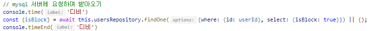
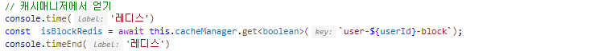
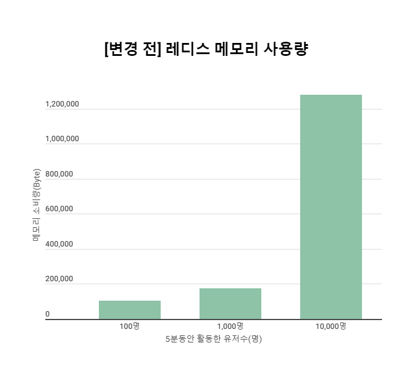
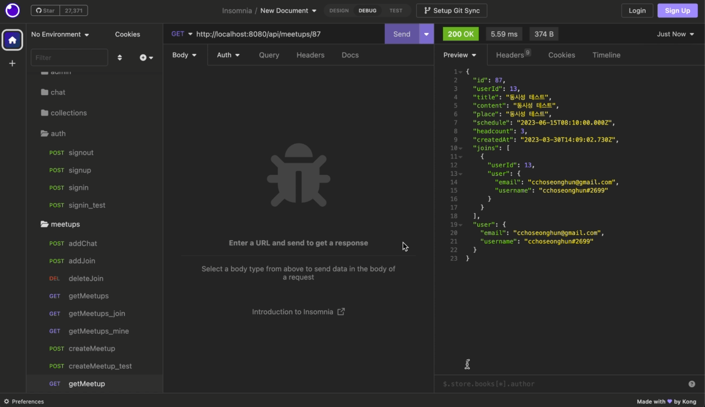
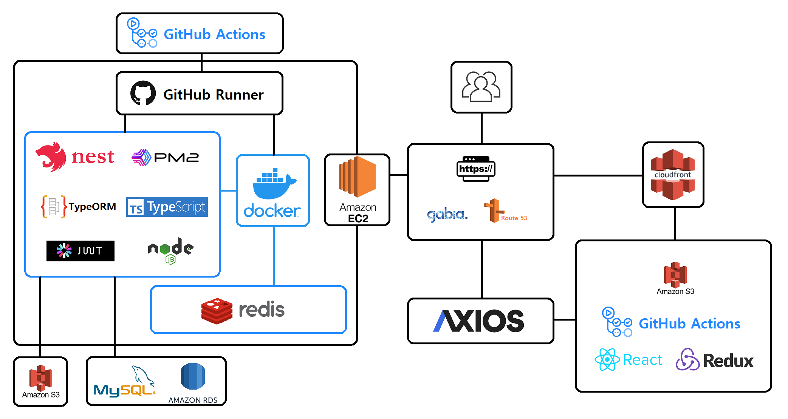

# 📸 사진촬영장소 공유 웹사이트, 찰칵!

[](https://www.chalkak.site)

<br>

여기저기 흩어져 있는 출사 관련 정보 및 커뮤니티를 한 곳에서!   
`찰칵(Chalkak)`은 출사 관련 정보를 공유하는 플랫폼이자 커뮤니티 입니다.   

나만이 알고 있는 매력적인 포토스팟을 테마별 콜렉션으로 공유하여   
누구나 쉽게 사진 명소를 찾을 수 있도록 돕습니다.   

찍고, 찍어주고, 대화하고, 함께해요!   
출사 모임을 직접 만들거나 참여하여 우리의 사진과 삶을 함께 나눕니다.

<br>
<br>

## 🌄 &nbsp;촬영장소와 사진을 공유할 수 있습니다!
<details>
  <summary>나만의 <code>콜렉션</code>을 만들어 <code>포토스팟</code>을 공유하세요.</summary>
  
</details>
<details>
  <summary>마음에 든 콜렉션에 하트를 눌러 <code>좋아요</code>를 표현하세요.</summary>
  
  <span>* 추후 좋아요한 콜렉션 목록 기능이 추가될 예정입니다.</span>
</details>

<br>

## 🏞 &nbsp;사진 추천 기능을 이용해보세요!
<details>
  <summary>사진 <code>라벨링</code> 기술을 통해 비슷한 사진을 추천해줍니다.</summary>
  
</details>

<br>

## 🌃 &nbsp;저랑 같이 사진 찍으러 갈래요?
<details>
  <summary><code>모임</code>을 만들어 같이 사진 찍으러 갈 동료를 구할 수 있습니다.</summary>
  
</details>
<details>
  <summary>주최자가 모집 마감 버튼을 누르면 <code>채팅</code> 메뉴에서 참여자들끼리 대화할 수 있습니다.</summary>
  
  
</details>

<br>
<br>

## 👀 &nbsp;자, 이제 준비 됐나요? `찰칵`을 직접 경험해보세요!

[📷 찰칵 사이트로 이동하기](https://www.chalkak.site)   

<br>
<br>

## 📌 목차 

- [시연 영상](#-시연-영상)
- [기술적 의사결정](#%EF%B8%8F-기술적-의사결정)
- [트러블슈팅](#%EF%B8%8F%EF%B8%8F-트러블슈팅)
- [서비스 아키텍처](#%EF%B8%8F-서비스-아키텍처)
- [프로젝트 구조](#-프로젝트-구조)
- [설계](#-설계)
- [지원하는 브라우저](#-지원하는-브라우저)
- [팀원 소개](#-팀원-소개)

<br>
<br>

## 🎥 시연 영상

> 아래 이미지를 클릭하면 시연 영상을 시청할 수 있습니다.

[](https://youtu.be/tZ_j9On3WuA)

<br>
<br>

## 👨‍⚖️ 기술적 의사결정

<details>
  <summary><b>[동시성 처리] Bull Queue</b></summary>
  <div markdown="1">
    </br>
    <ul>
      <li>도입배경</li>
        <ul>
          <li>모임 참여 기능에서 동시 요청으로 인해 정해진 신청 인원을 초과하는 상황을 고려하여 동시성 제어가 필요했다.</li>
        </ul>
      </br>
      <li>기술비교</li>
        <table width="70%">
          <thead>
            <tr>
              <th></th>
              <th>Bull Queue</th>
              <th>RabbitMQ</th>
              <th>Kafka</th>
            </tr>
          </thead>
          <tbody>
            <tr>
              <td>간단 설명</td>
              <td>Node.js용 메시지 큐</td>
              <td>AMQP 프로토콜을 기반으로 하는 오픈 소스 메시지 브로커</td>
              <td>분산 스트리밍 플랫폼</td>
            </tr>
            <tr>
              <td>성능</td>
              <td>Redis 기반 높은 성능 / 순서가 엄격히 보장 X</td>
              <td>고성능</td>
              <td>높은 처리량 / 낮은 지연 시간</td>
            </tr>
            <tr>
              <td>사용성</td>
              <td>가볍고 편리</td>
              <td>많은 클라이언트 라이브러리</td>
              <td>초기 설정 및 복잡한 운영</td>
            </tr>
            <tr>
              <td>안정성</td>
              <td>안정성 이슈 (Redis 및 처리량 관련)</td>
              <td>안정적 (AMQP 프로토콜 사용)</td>
              <td>높은 안정성</td>
            </tr>
            <tr>
              <td>효율성</td>
              <td>작은 규모의 메시지 큐에 적합</td>
              <td>작은 메시지 크기에 적합 / 처리량이 적은 경우 비효율</td>
              <td>대용량 데이터 처리 특화</td>
            </tr>
            <tr>
              <td>확장성</td>
              <td>높은 확장성, 분산 처리 지원</td>
              <td>높은 확장성, 분산 처리 지원</td>
              <td>높은 확장성, 분산 처리 지원</td>
            </tr>
            <tr>
              <td>보안성</td>
              <td>안전한 데이터 전송 및 저장</td>
              <td>안전한 데이터 전송 및 저장</td>
              <td>안전한 데이터 전송 및 저장</td>
            </tr>
            <tr>
              <td>사용 사례</td>
              <td>대규모 분산 시스템, 실시간 데이터 처리, 백그라운드 작업 처리</td>
              <td>대규모 분산 시스템, 메시지 큐, 이벤트 기반 애플리케이션</td>
              <td>대규모 분산 시스템, 이벤트 스트리밍 처리, 로그 수집 및 분석</td>
            </tr>
          </tbody>
        </table>
        </br>
        <ul>
          <li>Bull Queue</li>
            <ul>
              <li>장점</li>
                <ul>
                  <li>Node.js 환경에서 운영된다. </br>Node.js 개발자들이 쉽게 이용 가능하며 높은 처리량과 낮은 지연 시간을 제공한다.</li>
                  <li>Redis 기반이다.</li>
                </ul>
              <li>단점</li>
                <ul>
                  <li>다른 메시지 큐와 비교했을 때 기능이 제한적이며, 대규모 분산 시스템에서 사용성이 제한적이다.</li>
                </ul>
            </ul>
          </br>
          <li>RabbitMQ</li>
            <ul>
              <li>장점</li>
                <ul>
                  <li>AMQP 프로토콜을 기반으로 하여 안정성과 다양한 기능을 제공하며 다양한 언어를 지원하고 대규모 분산 시스템에서도 안정적으로 동작한다.</li>
                </ul>
              <li>단점</li>
                <ul>
                  <li>Broker 자체의 성능이 중요한 경우에는 다른 시스템과 비교해 처리량이 낮을 수 있다.</li>
                </ul>
            </ul>
          </br>
          <li>Kafka</li>
            <ul>
              <li>장점</li>
                <ul>
                  <li>높은 처리량과 낮은 지연 시간을 제공하며 분산 스트리밍 처리에 적합하다. </br>그리고 데이터를 병렬로 처리하기 때문에 처리량이 높다.</li>
                </ul>
              <li>단점</li>
                <ul>
                  <li>주로 대용량 처리를 위해 사용된다.</li>
                  <li>다른 메시지 큐에 비해 상대적으로 복잡하고 운영 관리가 어려울 수 있다.</li>
                </ul>
            </ul>
        </ul>
      </br>
      <li>최종결정</li>
        <ul>
          <li>Redis 기반의 빠른 처리 속도와 쉬운 사용성으로 작은 규모의 메시지 큐에 적합한 Bull Queue를 선택하여 동시성 제어를 위한 작업 대기열 방식으로 적용하기로 결정하였다.</li>
        </ul>
    </ul>
    </br>
  </div>
</details>

<details>
  <summary><b>[이미지 스토리지] AWS S3</b></summary>
  <div markdown="1">
    </br>
    <ul>
      <li>도입배경</li>
        <ul>
          <li>사진을 많이 저장하면 스토리지 공간을 확장해야 한다. </br>그렇기 때문에 스토리지 공간이 필요한 만큼 동적으로 할당하여 효율적으로 사진을 관리할 수 있는 클라우드 기반의 객체 스토리지 서비스가 필요했다.</li>
        </ul>
      </br>
      <li>기술비교</li>
        <table width="70%">
          <thead>
            <tr>
              <th></th>
              <th>AWS S3</th>
              <th>Google Cloud Storage</th>
              <th>Microsoft Azure Blob Storage</th>
            </tr>
          </thead>
          <tbody>
            <tr>
              <td>비용</td>
              <td>저렴한 가격 대비 높은 성능</td>
              <td>저렴한 가격 대비 높은 성능</td>
              <td>비교적 높은 가격</td>
            </tr>
            <tr>
              <td>기능성</td>
              <td>다양한 객체 타입 지원</td>
              <td>안정적이고 고성능</td>
              <td>관리 작업을 간소화하는 기능 제공</td>
            </tr>
            <tr>
              <td>보안성</td>
              <td>256-bit AES 암호화 및 HTTPS를 통한 데이터 전송 보안</td>
              <td>256-bit AES 암호화 및 HTTPS를 통한 데이터 전송 보안</td>
              <td>암호화, 로그 기록 및 액세스 제어 등 다양한 보안 기능 제공</td>
            </tr>
            <tr>
              <td>데이터 복제</td>
              <td>지리적으로 분산 된 데이터 복제 기능 제공</td>
              <td>지리적으로 분산 된 데이터 복제 기능 제공</td>
              <td>데이터 복제를 위해 LRS, GRS 및 RA-GRS 등 다양한 옵션 제공</td>
            </tr>
            <tr>
              <td>사용 편의성</td>
              <td>AWS Management Console, CLI, SDK 등 다양한 도구를 사용하여 구성 및 관리 가능</td>
              <td>RESTful API 및 CLI를 사용하여 쉽게 구성 및 관리 가능</td>
              <td>Azure Portal, PowerShell, CLI 등 다양한 도구를 사용하여 구성 및 관리 가능</td>
            </tr>
          </tbody>
        </table>
        </br>
        <ul>
          <li>AWS S3</li>
            <ul>
              <li>장점</li>
                <ul>
                  <li>저렴한 비용으로 매우 빠르고 안정적인 전송 속도와 데이터 신뢰성을 제공한다.</li>
                  <li>다양한 객체 타입을 지원하여 많은 종류의 데이터를 저장할 수 있다.</li>
                  <li>지리적으로 분산 된 데이터 복제 기능을 제공하여 데이터 손실을 방지한다.</li>
                  <li>AWS Management Console, CLI, SDK를 사용하여 구성 및 관리가 가능하다.</li>
                </ul>
              <li>단점</li>
                <ul>
                  <li>트래픽이 너무 많을 경우 비용이 높을 수 있다.</li>
                </ul>
            </ul>
          </br>
          <li>Google Cloud Storage</li>
            <ul>
              <li>장점</li>
                <ul>
                  <li>매우 빠르고 안정적인 전송 속도와 데이터 신뢰성을 제공한다.</li>
                  <li>저렴한 가격에 높은 성능을 제공한다.</li>
                  <li>지리적으로 분산 된 데이터 복제 기능을 제공하여 데이터 손실을 방지한다.</li>
                  <li>RESTful API와 CLI를 사용하여 쉽게 구성 및 관리할 수 있다.</li>
                </ul>
              <li>단점</li>
                <ul>
                  <li>AWS S3와 비교해서 객체 타입 지원 범위가 제한적이다.</li>
                </ul>
            </ul>
          </br>
          <li>Microsoft Azure Blob Storage</li>
            <ul>
              <li>장점</li>
                <ul>
                  <li>관리 작업을 간소화하는 기능을 제공해서 관리 작업을 자동화할 수 있다.</li>
                  <li>암호화, 로그 기록 및 액세스 제어 등 다양한 보안 기능을 제공한다.</li>
                  <li>Azure Portal, PowerShell, CLI를 사용하여 구성 및 관리가 가능하다.</li>
                </ul>
              <li>단점</li>
                <ul>
                  <li>비교적으로 높은 가격으로 서비스를 제공한다.</li>
                </ul>
            </ul>
        </ul>
      </br>
      <li>최종결정</li>
        <ul>
          <li>저렴한 비용과 AWS에서 RDS, EC2등 AWS서비스를 같이 사용하기 때문에 비용 관리가 용이하고, 접근하기 쉬운 API와 SDK를 제공한다. </br>그리고 자세하고 이해하기 쉽게 정리가 잘 되어있는 문서를 제공하기 때문에 결정하였다.</li>
        </ul>
    </ul>
    </br>
  </div>
</details>
 
<details>
  <summary><b>[DB 모델링] STI (Single Table Inheritance)</b></summary>
  <div markdown="1">
  </br>
    <ul>
      <li>도입배경</li>
        <ul>
          <li>이메일 및 소셜 로그인 회원의 DB에 저장되는 엔터티의 일부 칼럼이 다르므로, 싱글 및 멀티 테이블 상속 전략이 필요하다.</li>
        </ul>
      </br>
      <li>기술비교</li>
        <table width="70%">
          <thead>
            <tr>
              <th></th>
              <th>Single Table Inheritance</th>
              <th>Multi Table Inheritance</th>
            </tr>
          </thead>
          <tbody>
            <tr>
              <td>테이블 개수</td>
              <td>1</td>
              <td>2개 이상</td>
            </tr>
            <tr>
              <td>전체 조회</td>
              <td>간편</td>
              <td>복잡</td>
            </tr>
            <tr>
              <td>userId FK</td>
              <td>userId만 필요</td>
              <td>userId 및 provider 테이블</td>
            </tr>
            <tr>
              <td>추가 컬럼</td>
              <td>하위 엔티티 구분 컬럼 필요</td>
              <td>필요없음(서로 구분 됨)</td>
            </tr>
            <tr>
              <td>유효성 검사</td>
              <td>복잡</td>
              <td>간단</td>
            </tr>
          </tbody>
        </table>
        </br>
        <ul>
          <li>Single Table Inheritance</li>
            <ul>
              <li>장점</li>
                <ul>
                  <li>하나의 테이블에 모든 모델을 관리하기 때문에 간결성을 높이고 유지보수를 간단하게 만들어 준다.</li>
                  <li>조인이 필요 없으므로 조회 쿼리를 단순화 할 수 있기 때문에 조회 성능이 빠르다.</li>
                  <li>새로운 모델을 추가하더라도 별도의 테이블을 생성할 필요가 없어 유연하다.</li>
                </ul>
              <li>단점</li>
                <ul>
                  <li>자식 엔티티가 매핑한 칼럼은 모두 null을 허용해야 한다.</li>
                  <li>단일 테이블에 모든 것을 저장하므로 테이블의 크기가 커질 수 있다.</li>
                  <li>상황에 따라 조회 성능이 오히려 느려질 수 있다.</li>
                </ul>
            </ul>
          </br>
          <li>Multi Table Inheritance </li>
            <ul>
              <li>장점</li>
                <ul>
                  <li>상속된 열이 필요하지 않아서 중복 데이터가 감소한다.</li>
                  <li>새로운 모델을 추가하더라도 모델에 대한 테이블을 생성할 수 있다. </br>각 고유한 데이터를 저장하기 위한 공간을 제공하기 때문에 테이블 간의 관계를 간소화 할 수 있어 유연하다.</li>
                  <li>테이블 간의 관계를 구성할 수 있어 데이터베이스의 정규화 수준을 높일 수 있다.</li>
                </ul>
              <li>단점</li>
                <ul>
                  <li>복잡한 조인과 서브쿼리가 필요하다. </br>조회 쿼리가 복잡하기 때문에 조회 성능이 저하 될 수 있다.</li>
                  <li>각 모델에 대한 별도의 테이블이 있어서 유지보수가 어려울 수 있다.</li>
                  <li>테이블 간의 관계가 복잡해질 수 있다.</li>
                  <li>데이터베이스 디자인이 보다 어려워진다.</li>
                </ul>
            </ul>
        </ul>
      </br>
      <li>최종결정</li>
        <ul>
          <li>Multi Table Inheritance를 사용하면 조인이 복잡해지고 조회 성능이 느려진다. </br>유저는 여러 관계의 중심이 된다는 점에서 유저를 가리키는 외래키가 복합키가 되어 복잡성이 증가한다.</br>따라서 싱글 테이블 전략을 선택해서 조인을 단순화시켜 조회 성능을 올리고 연관성과 복잡성을 줄이는 것으로 결정했다.</li>
        </ul>
    </ul>
    </br>
  </div>
</details>

<details>
  <summary><b>[CI/CD] GitHub Actions</b></summary>
  <div markdown="1">
    </br>
    <ul>
      <li>도입배경</li>
        <ul>
          <li>직접 테스트 코드를 실행하고 수동으로 배포를 하는 번거로움이 있다. </br>이 과정을 자동화하여 개발 외에 소요되는 시간을 단축하고자 도입했다.</li>
        </ul>
      </br>
      <li>기술비교</li>
        <table width="70%">
          <tr>
            <th></th>
            <th>GitHub Actions</th>
            <th>Jenkins</th>
            <th>Travis CI</th>
          </tr>
          <tr>
            <td>설치 및 설정</td>
            <td>GitHub 저장소 내 워크플로우 파일 작성으로 간단히 설정 가능</td>
            <td>별도의 서버와 플러그인 설치 필요</td>
            <td>GitHub 저장소와 연동하여 간단히 설정 가능</td>
          </tr>
          <tr>
            <td>비용</td>
            <td>무료 티어 범위 초과 시 유료<br>비공개 저장소는 유료</td>
            <td>서버 유지 비용 발생</td>
            <td>공개 저장소는 무료</br>비공개 저장소는 유료</td>
          </tr>
          <tr>
            <td>트리거 설정</td>
            <td>매우 유연</td>
            <td>매우 유연</td>
            <td>유연</td>
          </tr>
          <tr>
            <td>지속적 통합</td>
            <td>지원</td>
            <td>지원</td>
            <td>지원</td>
          </tr>
          <tr>
            <td>지속적 배포</td>
            <td>지원</td>
            <td>지원</td>
            <td>지원</td>
          </tr>
          <tr>
            <td>테스트 병렬화</td>
            <td>지원</td>
            <td>지원</td>
            <td>지원</td>
          </tr>
          <tr>
            <td>사용 언어</td>
            <td>YAML</td>
            <td>Java</td>
            <td>Ruby</td>
          </tr>
        </table>
        </br>
        <ul>
          <li>GitHub Actions</li>
            <ul>
              <li>장점</li>
                <ul>
                  <li>매우 유연한 트리거 설정을 제공한다.</li>
                  <li>무료로 제공한다.</li>
                  <li>GitHub와 연동이 원할하다.</li>
                </ul>
              <li>단점</li>
                <ul>
                  <li>특정 플러그인 및 확장이 부족하다.</li>
                  <li>커스터마이징의 폭이 좁다.</li>
                  <li>상대적으로 새로운 기술이기 때문에 자료가 부족하고 커뮤니티의 참여가 적다.</li>
                </ul>
            </ul>
          </br>
          <li>Jenkins</li>
            <ul>
              <li>장점</li>
                <ul>
                  <li>커스터마이징의 폭이 넓다.</li>
                  <li>다양한 플러그인과 인터페이스를 지원한다.</li>
                  <li>매우 넓은 커뮤니티를 가지고있어 자료 찾기가 용이하다.</li>
                </ul>
              <li>단점</li>
                <ul>
                  <li>설정이 쉽지 않다.</li>
                  <li>보안 및 안정성 이슈가 발생할 수 있다.</li>
                  <li>많은 자원을 소비하고 느릴 수 있다.</li>
                </ul>
            </ul>
          </br>
          <li>Travis CI</li>
            <ul>
              <li>장점</li>
                <ul>
                  <li>쉽게 설정할 수 있다.</li>
                  <li>커스텀 빌드 환경을 지원한다.</li>
                </ul>
              <li>단점</li>
                <ul>
                  <li>일반적인 커스터마이징이 가능하다.</li>
                  <li>높은 비용이 발생할 수 있다.</li>
                </ul>
            </ul>
        </ul>
      </br>
      <li>최종결정</li>
        <ul>
          <li>무료로 이용할 수 있으면서 GitHub와의 연동이 매우 원활하고 접근성이 좋은 GitHub Action을 이용해 CI/CD를 도입할 수 있도록 결정했다.</li>
        </ul>
    </ul>
  </br>
  </div>
</details>

<br>
<br>

## 🕵️‍♂️ 트러블슈팅

### 유저 블락 전략

<details>
  <summary><b>유저 권한의 검증 문제</b></summary>
  <div markdown="1">
    </br>
    <ul>
      <li>발생 문제</li>
        <ul>
          <li>Passport를 사용한 AuthGuard를 통과한 이후 DB를 조회해 유저의 블락 여부를 확인하는 과정에서 DB 조회 횟수가 늘어나면서 성능 저하와 리소스 낭비 발생</li>
        </ul>
      </br>
      <li>해결과정</li>
        <ul>
          <li>매 API 요청마다 DB 조회를 하지 않기 위해 CacheManager로 DB에서 가져온 블락 여부에 대한 데이터를 5분 간 Cache (Redis)에 저장한다. </br>이를 통해 DB 조회 횟수를 줄여 리소스를 효율적으로 활용하고, 성능을 개선할 수 있었다.</li>
        </ul>
      </br>
      <li>결과</li>
        <ul>
          <li>외부 DB와의 통신에 따른 시간 소요와 DB 및 Redis와의 속도 차이로 인한 개선</li>
            <ul>
              <li>1회당 블락 유저 조회 소요 평균 시간</li>
                <ul>
                  <li>25.54ms ⇒ 1.7 ms (93.34% 단축)</li>
                  
                </ul>
            </ul>
          </br>
          <li><b>[기존]</b></br>DB에서 UserEntity의 isBlock 값을 가져와서 검증</li>
          
          </br>
          <li><b>[변경]</b></br>Cache (Redis)에 저장해 둔 isBlock 값을 가져와서 검증</li>
          
        </ul>
    </ul>
    </br>
  </div>
</details>

<details>
  <summary><b>Redis 부하 문제</b></summary>
  <div markdown="1">
    </br>
    <ul>
      <li>발생 문제</li>
        <ul>
          <li>API를 요청한 모든 유저의 블락 여부를 Redis에 캐싱하다 보니 Redis의 부하가 심해짐</li>
        </ul>
      </br>
      <li>해결과정</li>
        <ul>
          <li>블락된 유저의 정보를 Cache에 저장하고, 액세스 토큰의 만료 시간을 1시간으로 지정했다. </br>이를 통해 최근 1시간 동안 블락된 유저 숫자만큼만 Cache에 올라가게 되어, Cache 성능이 개선되었다. </br>또한, 액세스 토큰이 만료되면 로그아웃 처리를 하고, 로그인하지 못하도록 막아 보안성을 높였다.</li>
        </ul>
      </br>
      <li>수치 비교</li>
        <ul>
          <li><b>[기존]</b></br>유저수에 비례해 증가하던 기존 메모리 사용구조</li>
          
          </br>
          <li><b>[변경]</b></br>최대 100개 수준을 넘지 않는 메모리 사용구조</li>
          
        </ul>
    </ul>
  </div>
</details>

</br>

### 이미지 리사이징

<details>
  <summary><b>고화질 이미지의 처리 문제</b></summary>
  <div markdown="1">
    </br>
    <ul>
      <li>발생 문제</li>
        <ul>
          <li>이미지의 크기가 커질수록 이미지 업로드 및 웹 페이지 로딩 속도가 느려짐</li>
        </ul>
      <br>
      <li>해결과정</li>
        <ul>
          <li>sharp를 이용해 큰 사이즈의 사진을 찰칵 웹 페이지에 적합한 크기로 리사이징해 사이즈를 대폭 줄였다.</li>
        </ul>
      <br>
      <li>결과</li>
        <ul>
          <li>업로드 속도 ⇒ 약 297ms에서 134ms으로 54.21% 개선</li>
            <ul>
              <li>리사이징 전</li>
              
              <br>
              <li>리사이징 후</li>
              
            </ul>
          <br>
          <li>사진 SIZE ⇒ 160,324를 72,626으로 54.7% 감소</li>
            <ul>
              <li>리사이징 전</li>
              
              <br>
              <li>리사이징 후</li>
              
            </ul>
        </ul>
    </ul>
  </div>
</details>

</br>

### 즉각적인 Bull Queue 작업결과 응답

<details>
  <summary><b>요청 결과가 잘못되는 문제</b></summary>
  <div markdown="1">
    </br>
    <ul>
      <li>발생 문제</li>
        <ul>
          <li>모임 참여 신청 기능에서 Bull Queue로 구현한 후 아파치 Jmeter로 테스트를 했는데, 대기열에 Job을 넣은 이후 그 결과를 기다리지 않고 모든 요청에 대해 바로 성공 값을 반환하는 이슈가 발생 </br>(성공/실패 여부와 상관없이 항상 성공 결과 리턴)</li>
        </ul>
      <br>
      <li>해결과정</li>
        <ul>
          <li>작업이 완료될 때까지 잠시 기다린 후 응답을 반환하기 위해 메서드 간에 Event-Emitter를 사용했다.</li>
        </ul>
      <br>
      <li>결과</li>
        <ul>
          <li><b>[해결 전] Bull Queue만 사용</b></br>15, 16번 유저만 참여에 성공</br>참여에 실패한 14, 17, 18번 유저도 201 성공 결과를 반환 받고 있음</li>
          
          
          <br>
          <li><b>[해결 후] Event-Emitter를 통해 특정 이벤트를 기다리게 함</b></br>14, 15번 유저만 참여에 성공</br>참여에 실패한 16, 17, 18번 유저는 403 실패 결과를 반환 받음 (정원 초과)</li>
          
          
        </ul>
    </ul>
  </div>
</details>

<br>
<br>

## ⚙️ 서비스 아키텍처


<div>
  <!-- Nest.js -->
  
  <!-- Node.js -->
  
  <!-- TypeScript -->
  
</div>

<div>
  <!-- React -->
  
  <!-- Redux -->
  
</div>

<div>
  <!-- AWS -->
  
  
  
  
  <!-- GitHub Actions -->
  
</div>

<div>
  <!-- PM2 -->
  
  <!-- MySQL -->
  
  <!-- Redis -->
  
  <!-- GitHub -->
  
  <!-- Docker -->
  
</div>

<br>
<br>

## 🗂 프로젝트 구조

<details>
  <summary><b>Back-End (Nest.js)</b></summary>
  
```html
📦src
 ┣ 📂admin                  # 관리자 API
 ┣ 📂auth                   # 사용자 API
 ┣ 📂chat                   # 채팅 API
 ┣ 📂collections            # 콜렉션 API
 ┣ 📂common
 ┃ ┣ 📂aws                  # AWS S3 세팅 관련
 ┃ ┣ 📂config               # cache, typeorm 등의 세팅 관련
 ┃ ┣ 📂logging              # winston을 통한 로깅 관련
 ┃ ┗ 📂multer               # 이미지 업로드용 multer
 ┣ 📂googleVision           # Google vision API
 ┣ 📂guide                  # 서비스 이용안내 API
 ┣ 📂mailer                 # 메일 시스템 관련
 ┣ 📂meetups                # 같이찍어요 API
 ┣ 📂photospot              # 포토스팟 API
 ┣ 📂social                 # 소셜 로그인 관련
 ┣ 📜app.controller.ts
 ┣ 📜app.module.ts
 ┣ 📜app.service.ts
 ┗ 📜main.ts
```
</details>

<details>
  <summary><b>Front-End (React)</b></summary>

```html
📦src
 ┣ 📂environments           # 관리자 페이지에서의 컴포넌트 재활용을 위한 파일 관련
 ┣ 📂pages
 ┃ ┣ 📜AdminPage.js
 ┃ ┗ 📜UserPage.js
 ┣ 📂routes
 ┃ ┣ 📂Photospot            # 포토스팟 관련
 ┃ ┣ 📂admin                # 관리자 관련
 ┃ ┣ 📂auth                 # 사용자 관련
 ┃ ┣ 📂chat                 # 채팅 관련
 ┃ ┣ 📂collections          # 콜렉션 관련
 ┃ ┣ 📂components           # header, footer, nav 등 공통 컴포넌트 관련
 ┃ ┣ 📂guide                # 서비스 이용안내 관련
 ┃ ┣ 📂hoc                  # 고차 컴포넌트(HOC, Higher Order Component)로 사용자의 로그인 여부를 체크하는 컴포넌트 관련
 ┃ ┣ 📂main                 # 메인페이지 관련
 ┃ ┣ 📂meetups              # 같이찍어요 관련
 ┃ ┣ 📂oauth                # OAuth 로그인 관련
 ┃ ┣ 📂photo                # 사진 모아보기 관련
 ┃ ┣ 📜Main.js
 ┃ ┗ 📜NotFound.js
 ┣ 📂store                  # Redux slice 관련
 ┣ 📂utils
 ┃ ┣ 📜api-axios.js         # Axios 요청 관련 세팅 모듈화
 ┃ ┗ 📜controlCookie.js     # 쿠키 관리
 ┣ 📜App.js
 ┣ 📜index.js
```
</details>

[ Front-End 깃허브로 이동하기](https://github.com/chalkak2023/Chalkak-frontend)

<br>
<br>

## 🛠 설계

<details>
  <summary><b>ERD</b></summary>
  <div markdown="1">
    <ul>
      <div></div>
    </ul>
  </div>
</details>

<details>
  <summary><b>API</b></summary>
  <div markdown="1">
    <ul><li>이미지로 올리기엔 너무 긴 관계로 링크로 대체하였습니다.</li></ul>
    <ul>
      <a href="https://chalkak.notion.site/abed2bb362604af591ec713d8683f24f?v=14b01be7858842b396b16fa5e7d871cd" target="_blank" style="font-size: 25px;">[Notion 링크] API 보러가기</a>
    </ul>
  </div>
</details>

<br>
<br>

## 🌏 지원하는 브라우저

|  |  |  |
| :-: | :-: | :-: |
| Chrome | Edge | Safari |

<br>
<br>

## 👨‍👨‍👧‍👦 팀원 소개

|  |  |  |  |
| :-: | :-: | :-: | :-: |
| 이보형 | 조성훈 | 박무현 | 박진 |
| [GitHub](https://github.com/boleesystem), [블로그](https://boleesystem.tistory.com) | [GitHub](https://github.com/cchoseonghun), [블로그](https://4sii.tistory.com) | [GitHub](https://github.com/muja-code), [블로그](https://muja-coder.tistory.com) | [GitHub](https://github.com/tstunas), [블로그](https://velog.io/@tstunas3) |
| boleesystem@gmail.com | cchoseonghun@gmail.com | pla2697@gmail.com | zoc6521@naver.com |
